# Hướng dẫn dùng CMS — VinFast Ngọc Anh Cà Mau

Tài liệu dành cho anh/chị bán hàng, marketing, chăm sóc khách.  
Viết theo kiểu: **muốn làm gì → bấm đâu → làm thế nào**.

---

## Hai địa chỉ cần nhớ

| Việc | Mở link này |
|------|-------------|
| Xem website khách xem | https://vinfast3scamau.com |
| Vào trang quản trị (CMS) | https://cms.vinfast3scamau.com/admin/login |

CMS = chỗ **sửa nội dung**. Website = chỗ **khách xem**.  
Sửa xong trong CMS → mở website kiểm tra. Nếu chưa thấy đổi → xem mục [Website chưa cập nhật](#website-chưa-cập-nhật).

---

## Mục lục nhanh

1. [Đăng nhập](#1-đăng-nhập)
2. [Giao diện CMS nhìn thế nào](#2-giao-diện-cms-nhìn-thế-nào)
3. [Việc hay làm nhất (5 phút đọc)](#3-việc-hay-làm-nhất)
4. [Menu CMS mở ra trang web nào](#4-menu-cms-mở-ra-trang-web-nào)
5. [Sửa trang chủ](#5-sửa-trang-chủ)
6. [Sửa xe (ô tô / xe máy / phụ kiện)](#6-sửa-xe-ô-tô--xe-máy--phụ-kiện)
7. [Thêm xe mới](#7-thêm-xe-mới)
8. [Nhân bản xe (copy gần giống)](#8-nhân-bản-xe-copy-gần-giống)
9. [Ẩn hoặc xóa xe](#9-ẩn-hoặc-xóa-xe)
10. [Đăng tin tức](#10-đăng-tin-tức)
11. [Xử lý khách để lại form (Lead)](#11-xử-lý-khách-để-lại-form-lead)
12. [Upload ảnh](#12-upload-ảnh)
13. [Đổi banner danh mục](#13-đổi-banner-danh-mục)
14. [Đổi hotline / Zalo (nút nổi)](#14-đổi-hotline--zalo-nút-nổi)
15. [Các mục khác (ít dùng hơn)](#15-các-mục-khác-ít-dùng-hơn)
16. [Website chưa cập nhật](#website-chưa-cập-nhật)
17. [Khi nào hỏi kỹ thuật](#17-khi-nào-hỏi-kỹ-thuật)

---

## 1. Đăng nhập

1. Mở: https://cms.vinfast3scamau.com/admin/login  
2. Nhập email + mật khẩu được cấp.  
3. Vào được là thấy menu bên trái (Tổng quan, Trang chủ, Ô tô…).

Không vào được → kiểm tra đúng link, đúng email/mật khẩu. Vẫn lỗi → báo người cấp tài khoản.

---

## 2. Giao diện CMS nhìn thế nào

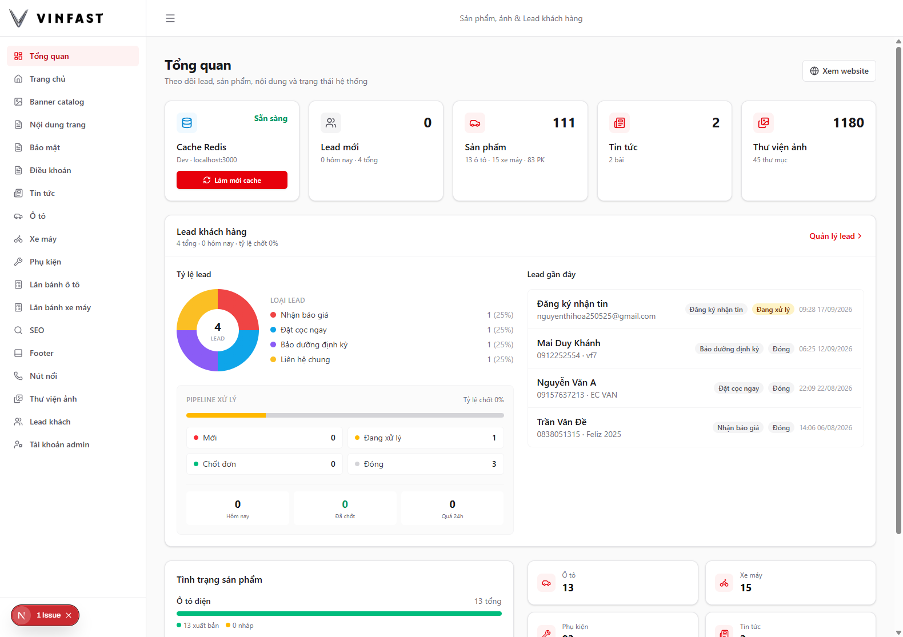

- **Bên trái:** menu — chọn phần muốn sửa.  
- **Bên phải:** nội dung làm việc.  
- **Đăng xuất:** cuối menu trái.

**Ai nên dùng mục nào?**

| Anh/chị làm việc | Vào các mục |
|------------------|-------------|
| Sale / CSKH | **Lead khách** |
| Marketing nội dung | Trang chủ, Tin tức, Ô tô/Xe máy/Phụ kiện, Banner, Thư viện ảnh |
| Phụ trách kỹ thuật / admin | SEO, Redirects, Tài khoản admin, Làm mới cache |

---

## 3. Việc hay làm nhất

| Muốn… | Vào menu | Làm nhanh |
|-------|----------|-----------|
| Đổi giá / gắn nhãn “Ưu đãi” | **Ô tô** hoặc **Xe máy** | Sửa trên thẻ xe → **Lưu thẻ** |
| Đổi giá / còn hàng phụ kiện | **Phụ kiện** | Sửa trên thẻ → **Lưu thẻ** |
| Đăng bài tin | **Tin tức** | **Viết bài mới** → **Xuất bản** |
| Gọi khách vừa form | **Lead khách** | Bấm **Gọi** → đổi trạng thái |
| Đổi banner trang chủ | **Trang chủ** | Bấm vào banner → đổi ảnh → **Lưu thay đổi** |
| Đổi hotline góc phải web | **Nút nổi** (+ SEO nếu cần) | Sửa link → **Lưu** |
| Thêm xe mới | **Ô tô** → **Thêm ô tô** | Chọn xe mẫu + đặt tên → mục 7 |
| Copy xe gần giống | Trang chi tiết xe → **Nhân bản** | Mục 8 |

---

## 4. Menu CMS mở ra trang web nào

Sửa trong CMS → kiểm tra đúng trang này trên https://vinfast3scamau.com

| Trong CMS (menu trái) | Trên website |
|-----------------------|--------------|
| **Trang chủ** | https://vinfast3scamau.com |
| **Banner catalog** → tab Ô tô | https://vinfast3scamau.com/oto |
| **Banner catalog** → tab Xe máy | https://vinfast3scamau.com/xe-may-dien |
| **Banner catalog** → tab Phụ kiện | https://vinfast3scamau.com/phu-kien |
| **Ô tô** (từng xe) | https://vinfast3scamau.com/oto/… |
| **Xe máy** (từng xe) | https://vinfast3scamau.com/xe-may-dien/… |
| **Phụ kiện** (từng món) | https://vinfast3scamau.com/phu-kien/… |
| **Tin tức** | https://vinfast3scamau.com/tin-tuc |
| **Nội dung trang** → Giới thiệu | https://vinfast3scamau.com/gioi-thieu |
| **Nội dung trang** → Hậu mãi | https://vinfast3scamau.com/dich-vu-hau-mai |
| **Nội dung trang** → Pin & sạc | https://vinfast3scamau.com/pin-va-tram-sac |
| **Nội dung trang** → Lưu trữ NL | https://vinfast3scamau.com/luu-tru-nang-luong |
| **Bảo mật** | trang chính sách bảo mật |
| **Điều khoản** | trang điều khoản |
| **Footer** / **Nút nổi** | hiện ở hầu hết mọi trang |
| **Lead khách** | không phải trang web — hộp thư form khách gửi |

> Trong CMS đôi khi thấy chữ `/preview` — đó là **bản xem để sửa**, không gửi khách. Nút **Xem trên web →** / **Website** mới là bản khách xem.

---

## 5. Sửa trang chủ

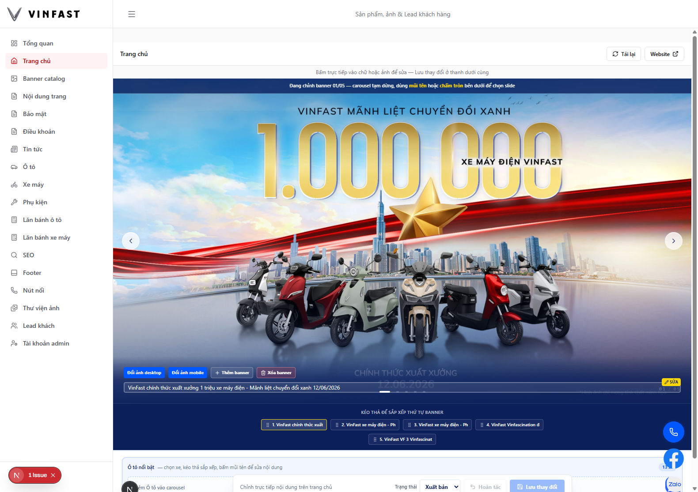

1. Menu **Trang chủ**.  
2. Đợi trang preview hiện (có banner). Trống quá lâu → bấm **Tải lại**.  
3. **Bấm thẳng** vào chữ hoặc ảnh muốn sửa.  
4. Cuộn xuống phần **Ô tô nổi bật** / **Xe máy nổi bật** để chọn xe hiện trên trang chủ:

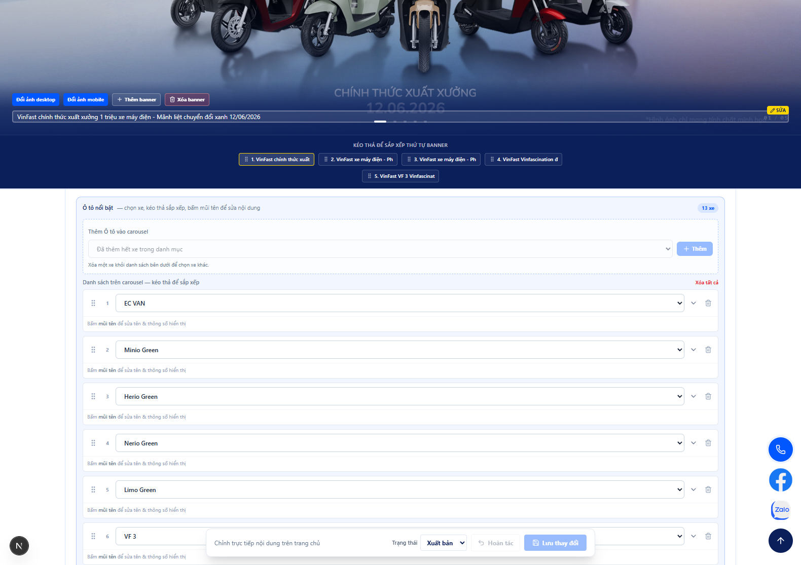

5. Thanh dưới cùng: chọn trạng thái **Xuất bản** → bấm **Lưu thay đổi**.  
6. Mở https://vinfast3scamau.com xem đã đúng chưa.

**Ý nghĩa nút:**

- **Hoàn tác** = hủy chỉnh chưa lưu  
- **Lưu thay đổi** = ghi nhận  
- **Website** = mở trang khách  

---

## 6. Sửa xe (ô tô / xe máy / phụ kiện)

Ba menu **Ô tô**, **Xe máy**, **Phụ kiện** thao tác gần giống nhau.

### 6.1 Ô tô / Xe máy

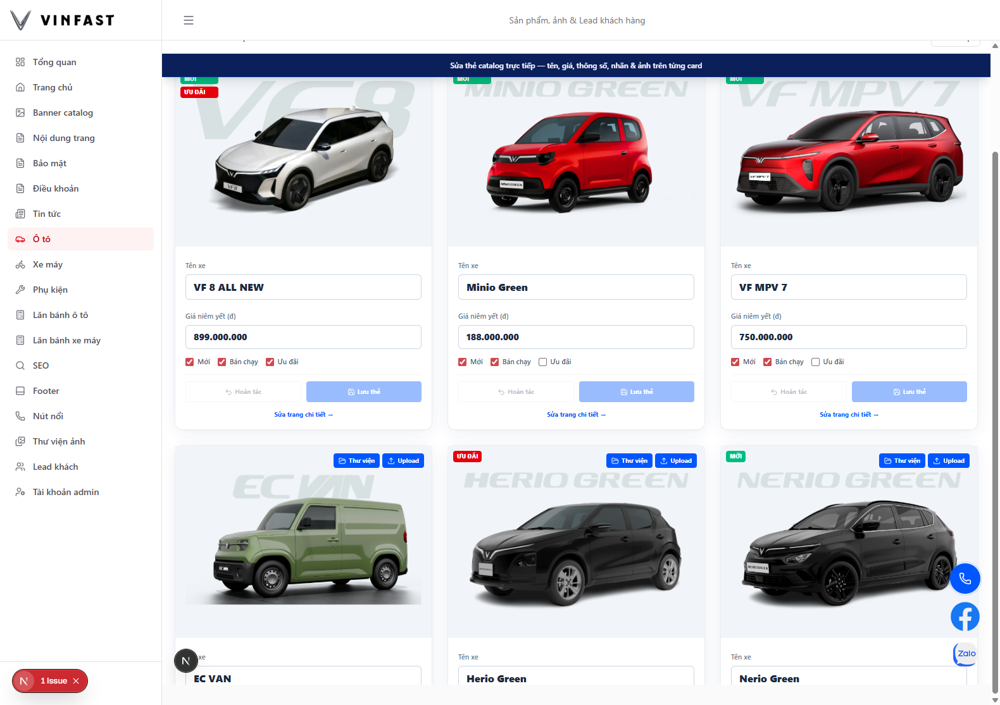

#### Cách A — Đổi nhanh giá / tên / nhãn (hay dùng)

1. Vào **Ô tô** (hoặc **Xe máy**).  
2. Thấy lưới thẻ xe.  
3. Sửa **Tên** hoặc **Giá**.  
4. Tick **Mới / Bán chạy / Ưu đãi** nếu cần.  
5. Đổi ảnh: **Thư viện** hoặc **Upload**.  
6. Bấm **Lưu thẻ**.

Xe máy:

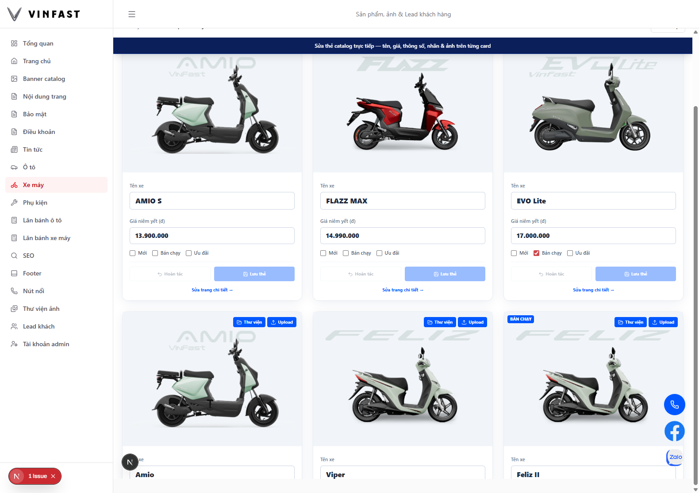

#### Cách B — Sửa cả trang chi tiết xe (nội dung dài)

1. Trên thẻ xe bấm **Sửa trang chi tiết →**  
   (hoặc mở **Quản lý ô tô → Mở danh sách → Sửa**).  
2. Có 3 tab:

| Tab | Dùng để |
|-----|---------|
| **Nội dung** | Sửa chữ, ảnh, gallery, màu… ngay trên trang xe |
| **Thông tin** | Tên, đường dẫn URL, giá từ, trạng thái xuất bản |
| **SEO** | Tiêu đề / mô tả Google |

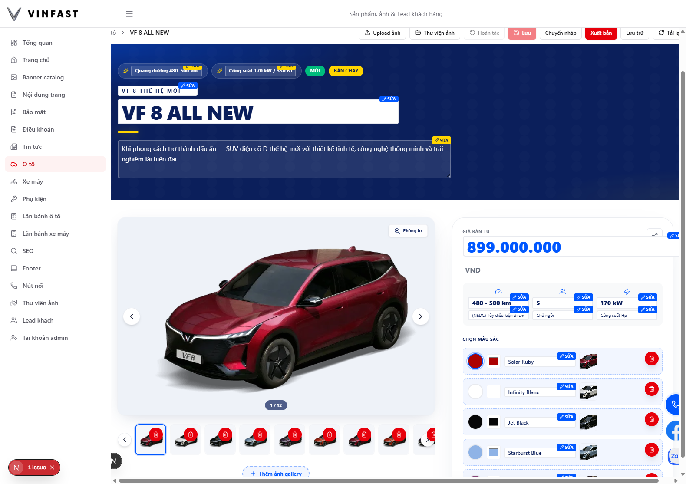

3. Trong tab **Nội dung**: bấm **SỬA** cạnh chỗ cần đổi → xong bấm **Lưu** trên thanh công cụ.  
4. Muốn hiện trên web: bấm **Xuất bản**.  
5. Bấm **Xem trên web →** để kiểm tra.

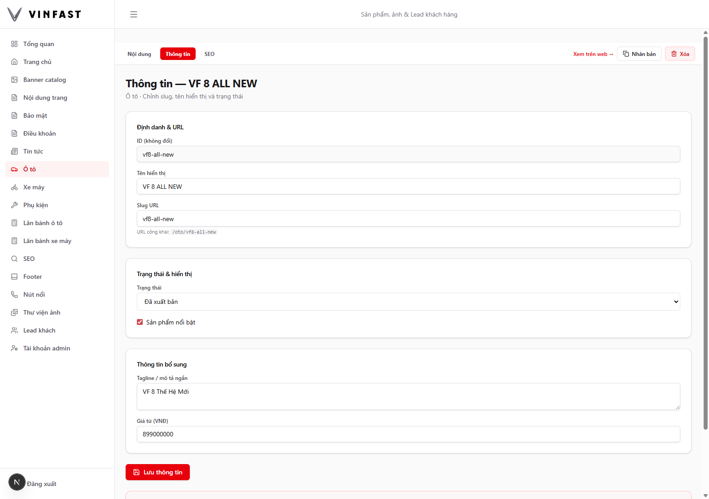

#### Đổi thứ tự xe trên danh mục

1. **Ô tô** → mở panel **Quản lý ô tô** → **Mở danh sách**.  
2. Bật **Sắp xếp thứ tự**.  
3. Kéo thả xe lên/xuống — **tự lưu**.  
4. Xong thì bấm **Xong sắp xếp**.

---

### 6.2 Phụ kiện (khác ô tô một chút)

Vào menu **Phụ kiện** — vẫn có lưới thẻ + **Lưu thẻ**, nhưng trên mỗi thẻ còn sửa thêm:

| Ô trên thẻ | Ý nghĩa |
|------------|---------|
| **Tên sản phẩm** | Tên hiện trên web |
| **Mô tả ngắn** | Đoạn mô tả dưới tên |
| **Giá bán ưu đãi** | Giá hiện khách |
| **Badge** | Chữ nhỏ trên ảnh (nếu có) |
| **Danh mục** | Nội thất / Ngoại thất / Sạc… |
| **Dòng xe** | Xe nào dùng được (ví dụ VF 8) |
| **Còn hàng** | Tắt = hiện hết hàng |

Sau khi sửa → **Lưu thẻ**.  
Muốn sửa sâu hơn → **Sửa trang chi tiết →** (giống ô tô: tab Nội dung / Thông tin / SEO).

**Thêm phụ kiện mới:** **Phụ kiện → Thêm phụ kiện** → chọn mẫu + tên → chọn **xe tương thích** (để ảnh đúng thư mục) → tạo nháp → upload ảnh → xuất bản (xem mục 7).

---

## 7. Thêm xe mới

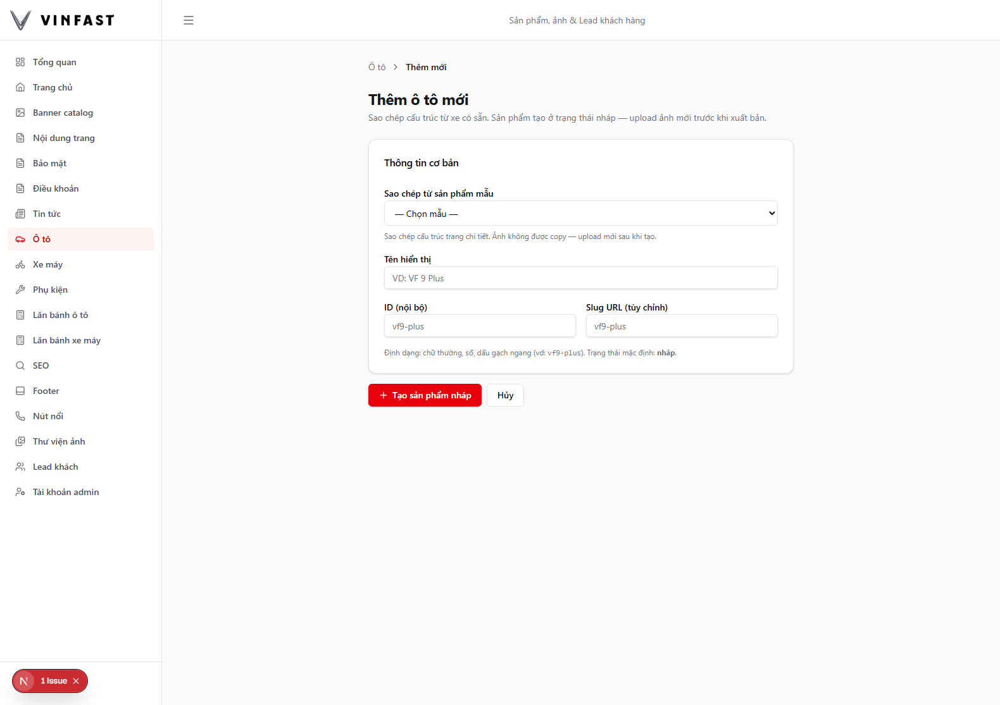

> Hệ thống bắt buộc **chọn một xe mẫu** để copy khung trang. Ảnh **không** copy theo — phải upload sau.

**Làm lần lượt:**

1. **Ô tô → + Thêm ô tô** (hoặc Xe máy / Phụ kiện tương ứng).  
2. Chọn **Sao chép từ sản phẩm mẫu** (xe gần giống nhất).  
3. Điền **Tên hiển thị** (ví dụ: `VF 9 Plus`).  
4. ID và đường dẫn URL thường tự sinh — chỉ sửa nếu cần.  
5. Bấm **Tạo sản phẩm nháp**.  
6. Tiếp theo bắt buộc:
   - Tab **Thông tin**: giá từ → **Lưu thông tin**  
   - Upload ảnh (đại diện + gallery)  
   - Tab **Nội dung**: chỉnh chữ → **Lưu**  
   - Tab **SEO**: điền title/mô tả → **Lưu SEO**  
7. Bấm **Xuất bản**.  
8. **Xem trên web →** kiểm tra.

**Phụ kiện:** nhớ chọn **xe tương thích** lúc tạo. Không chọn → ảnh vào thư mục phụ kiện chung.

---

## 8. Nhân bản xe (copy gần giống)

Dùng khi ra phiên bản mới **gần giống** xe đang có (đỡ dựng lại từ đầu).

1. Vào trang chi tiết xe gốc (**Sửa trang chi tiết**).  
2. Thanh trên bấm **Nhân bản**.  
3. Điền **Tên bản sao** (và đường dẫn URL nếu cần).  
4. Bấm **Tạo bản sao** → hệ thống tạo bản **nháp** mới.  
5. **Upload ảnh mới** cho bản sao (đừng để ảnh nhầm với xe cũ).  
6. Chỉnh nội dung / giá nếu khác.  
7. **Xuất bản** → **Xem trên web**.

> Nhân bản nhanh hơn khi chỉ đổi vài chỗ so với tạo mới hoàn toàn.

---

## 9. Ẩn hoặc xóa xe

| Muốn | Làm gì | Ghi chú |
|------|--------|---------|
| Ẩn tạm, còn lấy lại sau | Trang chi tiết → **Chuyển nháp** hoặc **Lưu trữ** | An toàn |
| Xóa hẳn | Nút **Xóa** → xác nhận | **Không hoàn tác** |

- Xóa **ô tô / xe máy** cũng xóa luôn thư mục ảnh của xe đó.  
- Xóa **phụ kiện** chỉ xóa dữ liệu, không xóa ảnh chung.

Khuyến nghị: chưa chắc thì **Nháp / Lưu trữ**, đừng xóa.

---

## 10. Đăng tin tức

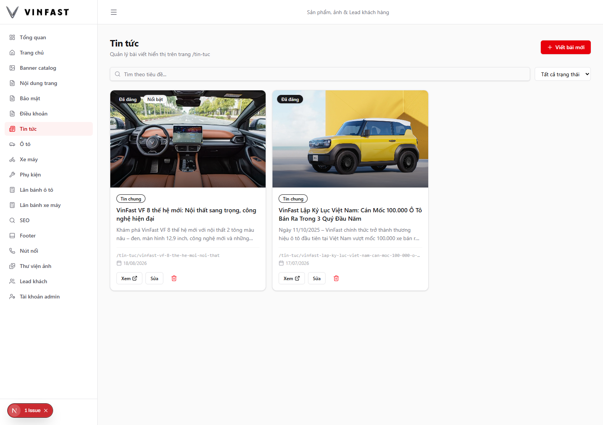

### Viết bài mới

1. **Tin tức → Viết bài mới**.  
2. Điền tiêu đề, nội dung.  
3. Chọn **Ảnh bìa** từ thư viện.  
4. Chọn danh mục, ngày đăng.  
5. Bấm:
   - **Lưu nháp** = chưa hiện web  
   - **Xuất bản** = hiện ngay trên https://vinfast3scamau.com/tin-tuc  
   - **Lên lịch** = đăng đúng giờ đã chọn  

### Sửa / xóa bài

- **Sửa** trên thẻ bài.  
- **Xóa** = thùng rác → xác nhận (không lấy lại được).

---

## 11. Xử lý khách để lại form (Lead)

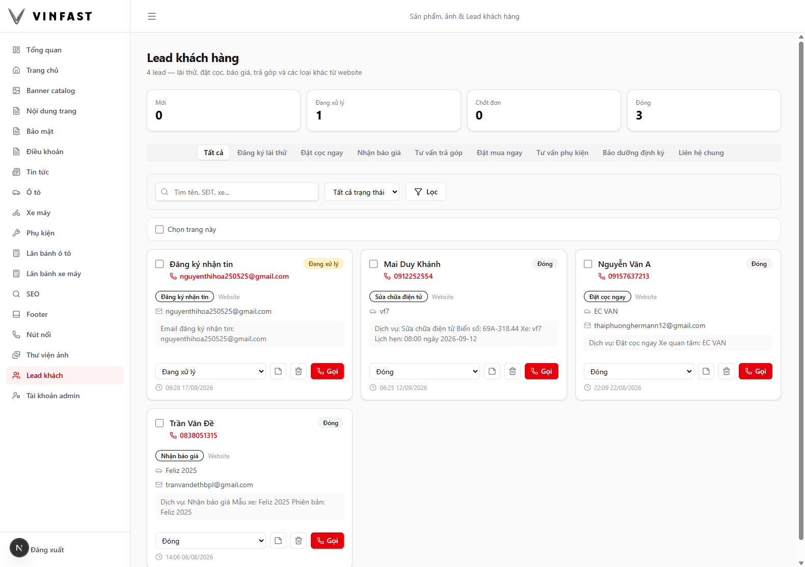

Khách gửi form trên web (báo giá, đặt cọc, lái thử…) sẽ vào đây.

**Mỗi ngày nên:**

1. Vào **Lead khách**.  
2. Ưu tiên trạng thái **Mới**.  
3. Bấm **Gọi**.  
4. Đổi trạng thái:
   - Đang xử lý → đang tư vấn  
   - Chốt đơn → đã chốt  
   - Đóng → không còn nhu cầu  
5. Ghi chú nội bộ nếu cần.

Có thể lọc theo loại form (báo giá, đặt cọc…) và tìm theo tên / SĐT.

---

## 12. Upload ảnh

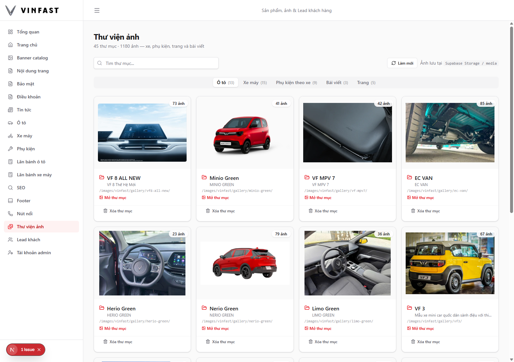

1. Vào **Thư viện ảnh**.  
2. Chọn tab: Ô tô / Xe máy / Phụ kiện / Bài viết / Trang.  
3. **Mở thư mục** đúng xe hoặc bài.  
4. **Tải nhiều ảnh** hoặc kéo thả vào.  
5. Khi sửa xe/tin: chọn **Thư viện** / **Chọn từ thư viện** thay vì dán link lung tung.

**Cẩn thận:** đừng **Xóa thư mục** nếu chưa chắc ảnh còn đang dùng trên web.

---

## 13. Đổi banner danh mục

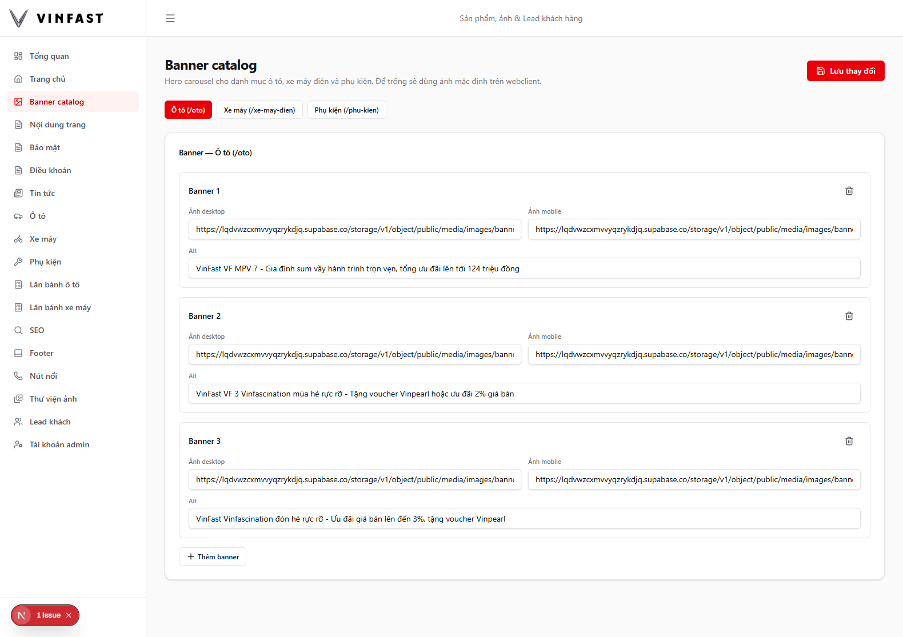

Banner lớn trên trang danh mục ô tô / xe máy / phụ kiện (xem bảng mục 4).

1. **Banner catalog**.  
2. Chọn tab Ô tô / Xe máy / Phụ kiện.  
3. Điền ảnh desktop, ảnh mobile, mô tả Alt.  
4. **+ Thêm banner** hoặc xóa banner cũ.  
5. **Lưu thay đổi**.

Nên lấy URL ảnh từ **Thư viện ảnh**.

---

## 14. Đổi hotline / Zalo (nút nổi)

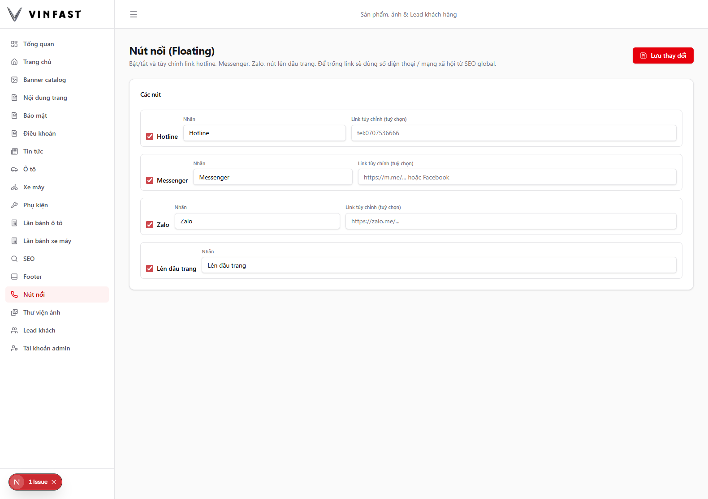

Các nút góc phải website (gọi, Messenger, Zalo, lên đầu trang).

1. **Nút nổi**.  
2. Bật/tắt từng nút, sửa số điện thoại / link.  
3. **Lưu thay đổi**.  

Đổi hotline “chính thức” của đại lý: sửa thêm ở **SEO → Cài đặt chung** (để Footer / thông tin chung khớp).

---

## 15. Các mục khác (ít dùng hơn)

### Nội dung trang (Giới thiệu, hậu mãi…)

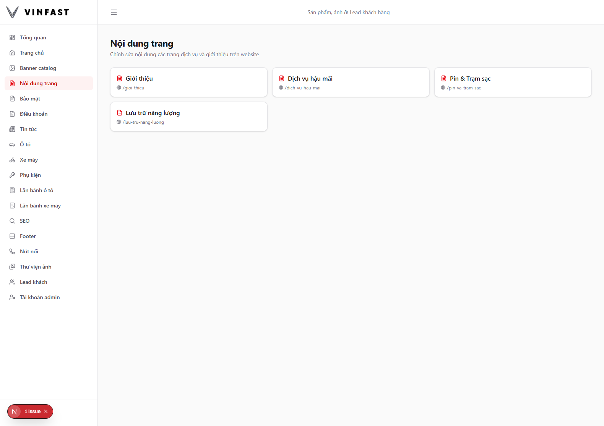

Bấm thẻ trang → sửa như trang chủ (bấm chữ/ảnh) → Lưu.  
Link web tương ứng xem **mục 4**.

### Bảo mật / Điều khoản

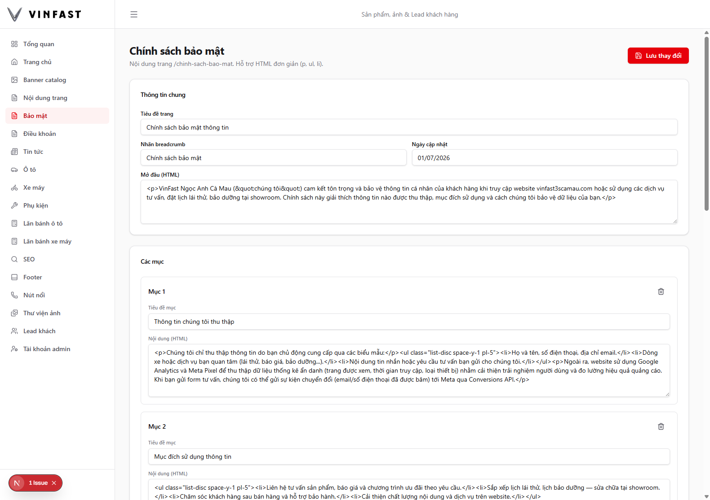

Sửa tiêu đề + các mục → **Lưu thay đổi**.

### Footer (chân trang)

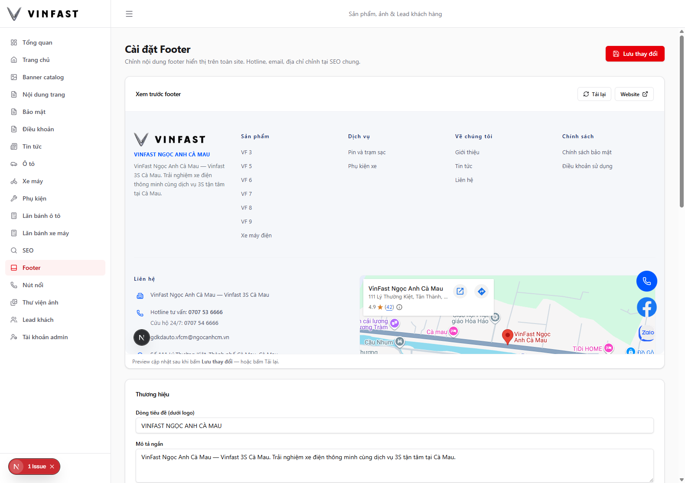

Sửa chữ thương hiệu + link các cột → **Lưu thay đổi**.

### Giá lăn bánh (phí đăng ký, biển số…)

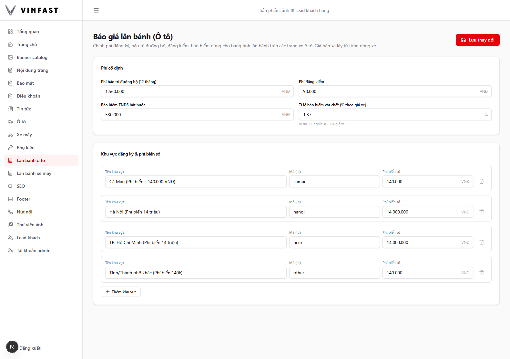

- **Lăn bánh ô tô** / **Lăn bánh xe máy**  
- Chỉ sửa **phí** (đăng kiểm, bảo hiểm, phí biển theo tỉnh…)  
- **Không** phải chỗ đổi giá bán xe (giá bán sửa ở menu Ô tô/Xe máy)  
- Xong → **Lưu thay đổi**

### SEO (Google / mạng xã hội)

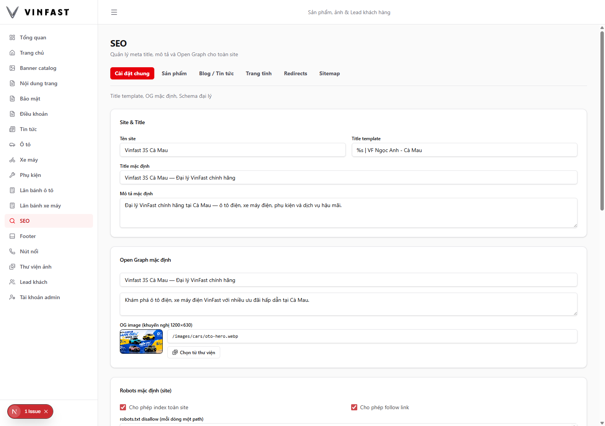

| Tab | Khi nào dùng |
|-----|----------------|
| Cài đặt chung | Tên site, mô tả mặc định, hotline chung |
| Sản phẩm / Blog / Trang tĩnh | SEO từng trang |
| Redirects | Đổi link cũ → link mới (**nên nhờ kỹ thuật**) |
| Sitemap | Danh sách trang Google đọc |

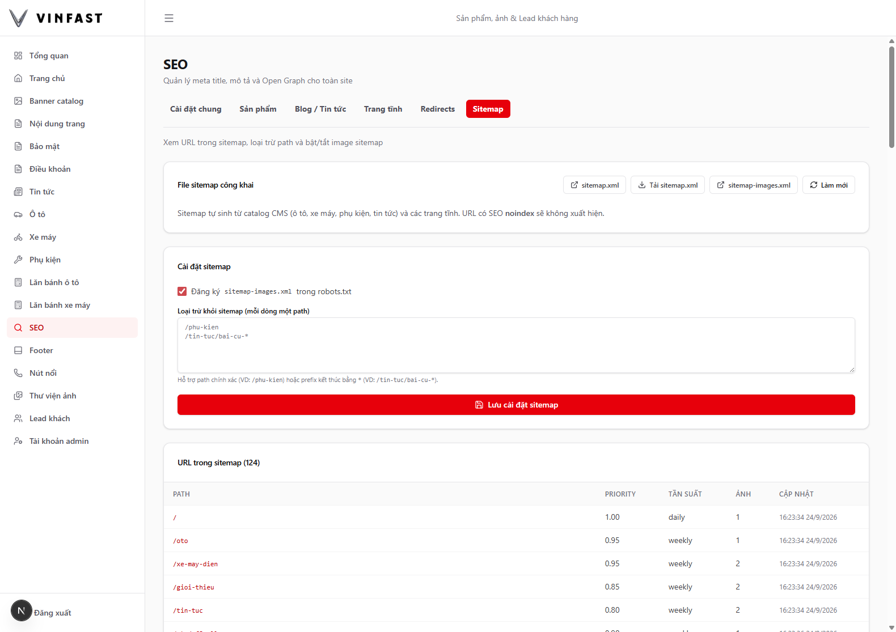

### Tài khoản admin

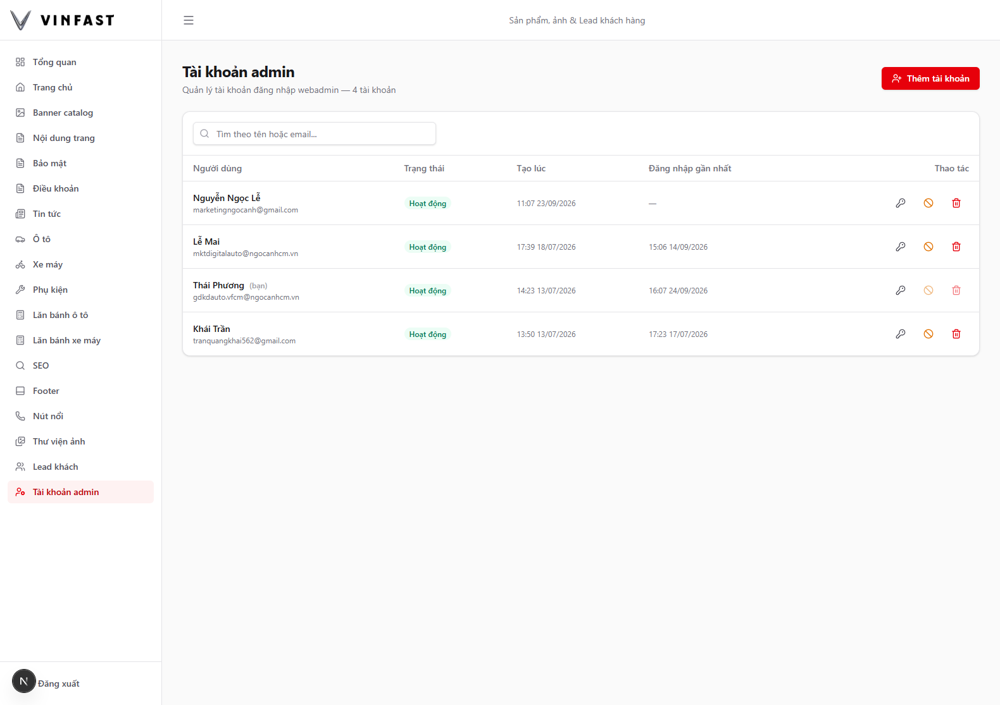

Thêm người dùng, đổi mật khẩu, chặn / xóa tài khoản.  
Không tự xóa hoặc chặn tài khoản đang đăng nhập của mình.

---

## Website chưa cập nhật

Đã **Lưu** trong CMS nhưng https://vinfast3scamau.com vẫn cũ:

1. Vào **Tổng quan**.  
2. Bấm **Làm mới cache** (làm mới bộ nhớ tạm của website).  
3. Mở lại website, nhấn **Ctrl + F5** (tải lại mạnh).

Không cần bấm mỗi lần sửa nhỏ nếu web đã hiện đúng.

---

## 17. Khi nào hỏi kỹ thuật

Nhờ người phụ trách kỹ thuật khi:

- Sửa **Redirects**, chặn Google (robots), sitemap phức tạp  
- Web lỗi / preview trắng lâu  
- Cần tạo / khóa nhiều tài khoản admin  
- Xóa nhầm dữ liệu quan trọng  

---

## Tóm tắt một dòng

> **CMS** (cms.vinfast3scamau.com) = chỗ sửa · **Web** (vinfast3scamau.com) = chỗ khách xem · Sửa xong nhớ **Lưu** · Không thấy đổi thì **Làm mới cache**.

---

## File gửi anh/chị khác

| File | Dùng |
|------|------|
| File Word / PDF cùng thư mục này | In hoặc gửi Zalo / email |
| `QUY-TRINH-NHANH.md` | Giấy nháp 1 trang |

*Cập nhật 09/2026 — VinFast Ngọc Anh Cà Mau.*
